# NASCAR 25 Setup Lab — Full Product, UX, and Technical Audit

**Audit date:** August 21, 2026  
**Audit target:** Current working checkout and local Sites preview for `nascar-25-setup-lab`  
**Hosted state checked:** Sites version 7; access mode is public  
**Method:** Route-by-route visual review, desktop interaction testing, keyboard testing, source inspection, architecture review, and automated validation

## Executive verdict

NASCAR 25 Setup Lab has a distinctive, coherent visual system and unusually strong honesty about where its data comes from. The typography, motorsport-inspired framing, empty states, and device-local ownership story are credible foundations.

The product is not yet a dependable setup lab, however. It is currently a **reference companion and personal race notebook with setup notes attached**. Its most serious problems are not cosmetic:

1. A new race can silently reuse and convert the current practice or qualifying session into a race session.
2. The setup used for a race is not durably represented, so different parts of the app can attribute the same result to different setups.
3. Average lap time is stored at session level but presented as setup performance, creating unsupported causal claims when multiple setup deltas exist in one session.
4. Backup import validation is too shallow for a local-first product and accepts dangerous URI schemes in imported source links.
5. Multiple tabs can overwrite one another because each tab rewrites the entire root document without conflict detection.

These issues make the current analytics and setup conclusions unreliable. Feature expansion should pause until the session, setup, run, and result relationships are corrected.

**Overall assessment: 5.8/10 — strong shell and trust posture, weak core setup semantics.**

## Scope and evidence limits

This audit covers:

- Dashboard
- Race logging
- Statistics
- Driver directory
- Track directory
- Track history
- Setup notebook and setup-entry flow
- Schedule
- Command palette
- Backup/import behavior
- Navigation and URL behavior
- Accessibility and keyboard behavior
- Responsive implementation by source inspection
- Local-first storage architecture
- Offline/PWA behavior
- Security, privacy messaging, performance, and test coverage
- The unpublished crawler/review routes currently present in the working checkout

The visual review used a desktop viewport. The runtime did not expose viewport emulation, so mobile behavior was assessed from source and layout rules rather than a captured mobile session. Official NASCAR 25 reference-data freshness was not independently reconciled against every external source. The working checkout contains unpublished changes, so the local preview is not necessarily identical to hosted version 7.

## Scorecard

| Dimension | Score | Assessment |
|---|---:|---|
| Visual system | 8/10 | Distinctive, cohesive, readable, and appropriate to motorsport without looking like a generic dashboard. |
| Trust and provenance | 9/10 | Excellent disclosure of manual entry, no live telemetry, and source boundaries. Some copy is too dominant. |
| Core setup utility | 3/10 | Freeform notes and deltas do not yet form a structured, comparable setup-development workflow. |
| Workflow clarity | 5/10 | Individual forms are understandable, but navigation, session continuity, and outcome attribution are inconsistent. |
| Data integrity | 4/10 | Several relationships are implicit or inferred, creating silent mutation and misleading analytics. |
| Information architecture | 4/10 | Seven top-level areas give reference content equal weight to the central setup workflow. |
| Accessibility | 5/10 | Semantic headings and labels are often good; the command palette breaks modal focus behavior and mobile labels are too small. |
| Performance | 6/10 | Acceptable for a small local app, but large server-rendered directories and a shared bundle create avoidable cost. |
| Offline/local ownership | 7/10 | IndexedDB, export, and explicit device-local messaging are strong; deep-link caching and multi-tab safety are weak. |
| Scope discipline | 4/10 | Drivers, tracks, schedule, source audits, and crawler pages overshadow the setup lab’s primary job. |

## Core product diagnosis

### What the product currently promises

The name and visual hierarchy imply a tool for building, testing, comparing, and refining NASCAR 25 setups.

### What the product currently delivers

- A manual race log
- A freeform setup notebook
- Self-logged statistics
- Large static driver, track, and real-world schedule references
- Device-local storage, export, and import
- Strong explanations of what is and is not official or live

### The mismatch

The central setup task is below the fold and less developed than the reference catalogs. A user cannot yet answer the questions a setup lab should make easy:

- What exact baseline did I start from?
- Which revision was installed for this run?
- What did I change, and why?
- Under what track, car, series, game version, weather, time-of-day, tire, fuel, controller, and assist conditions?
- Which laps belong to that revision?
- Did the change improve pace, consistency, tire behavior, or drivability?
- Can I reproduce the same setup later?

Until those questions have first-class data, the app should describe itself as a setup notebook or evolve its model to match the “Setup Lab” promise.

## Route-by-route audit

### 1. Dashboard — **Needs prioritization**

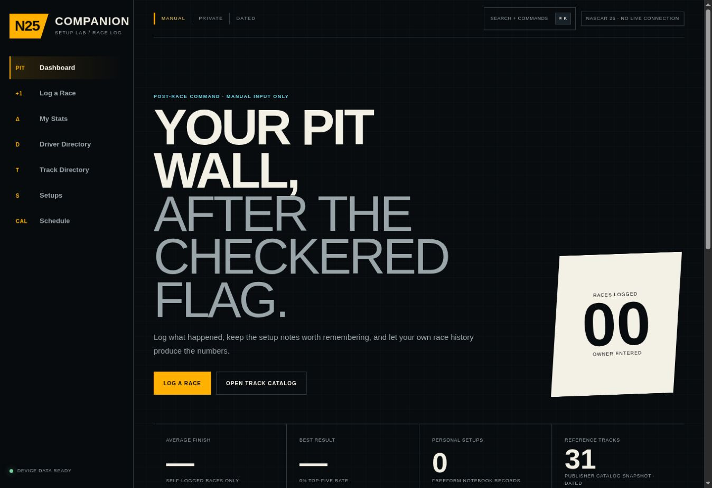

**What works**

- Strong brand impression and clear visual character.
- Truthful empty state and local-data language.
- Primary actions are visible and visually distinct.
- Source and data-boundary messaging builds credibility.

**Problems**

- The oversized headline consumes most of the first viewport.
- “Log a race” and “Open track catalog” are promoted, but “Start setup session” is absent.
- Long provenance copy occupies product-critical space that should establish the current setup program, last run, and next action.
- Dashboard buttons use internal React state and leave the URL at `/`, while sidebar links use route URLs. Back, refresh, and sharing therefore behave inconsistently.

**Recommendation**

Make the first viewport answer: current car/series, current track, current setup revision, last run result, and next test action. Move the long boundary statement behind a concise “How data works” disclosure.

### 2. Log Race — **Usable form, unsafe session behavior**

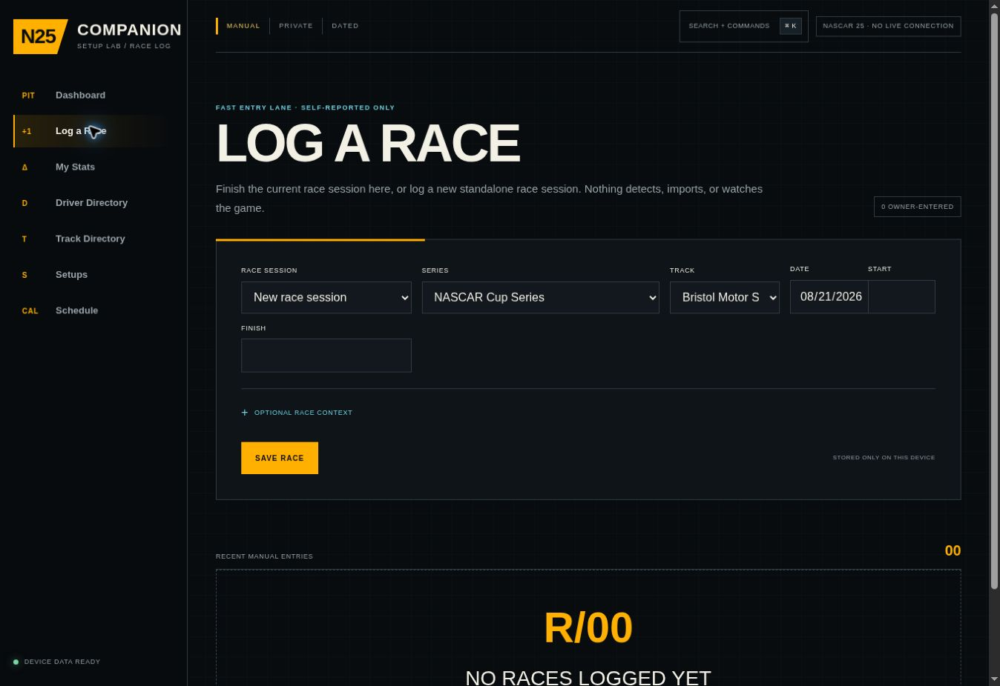

**What works**

- Fast, straightforward form layout.
- Optional context is visually subordinate.
- Native required-field validation prevents an entirely blank submission.
- The local-storage state is disclosed at the point of action.

**Problems**

- Selecting “New race session” sends no session ID. The store then falls back to the globally current session and changes its type to `race`, which can silently convert an active practice or qualifying session.
- There is no durable `appliedSetupId` on the race or session result.
- The user cannot review the exact setup revision and conditions before committing the result.
- Native-only errors are not summarized or announced consistently.

**Recommendation**

“New race session” must always create a new race session. Show a confirmation summary containing track, series, setup revision, start, finish, laps, and conditions before save.

### 3. Stats — **Honest empty state, unreliable attribution model**

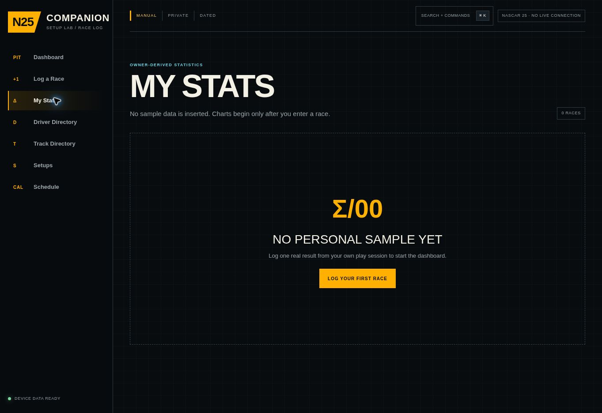

**What works**

- The empty state does not fabricate activity.
- The first-race call to action is clear.
- The proposed visual vocabulary for finish trends and heatmaps fits the domain.

**Problems**

- The app chooses the most recently updated setup for a session, while another flow can choose the first matching setup. The same race can therefore be credited differently.
- Session-level average lap times are attributed to setup candidates, which is invalid when multiple deltas share one session.
- Global setup rankings compare unlike tracks and contexts.
- Labels such as “Best observed setup” and “Fastest avg lap” imply causal confidence the data model does not support.

**Recommendation**

Only compare revisions within the same car/series, track configuration, condition class, and run protocol. Label small samples explicitly and separate observed correlation from a proven setup effect.

### 4. Driver Directory — **Functional reference, excessive prominence**

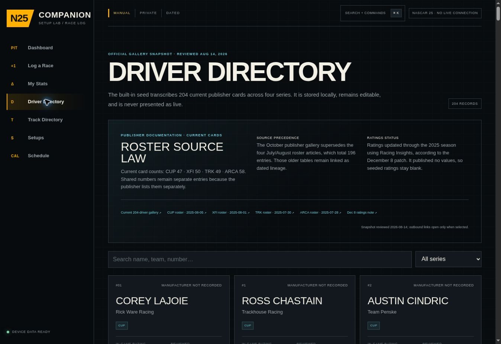

**What works**

- Search works and correctly returns duplicate people across series.
- Source-law and manual-maintenance boundaries are explicit.
- Cards are readable and consistent.

**Problems**

- All 204 records render at once; the route HTML is roughly 217 KB before normal client resources.
- A destructive Delete action is prominent on every seeded official-reference card.
- The long source audit precedes the directory and delays the actual task.
- This route has limited direct value during setup iteration but occupies top-level navigation.

**Recommendation**

Move Drivers under Reference/More, paginate or virtualize the list, demote destructive actions to an overflow menu, and reduce provenance to a compact source header.

### 5. Track Directory — **Useful reference, overloaded card actions**

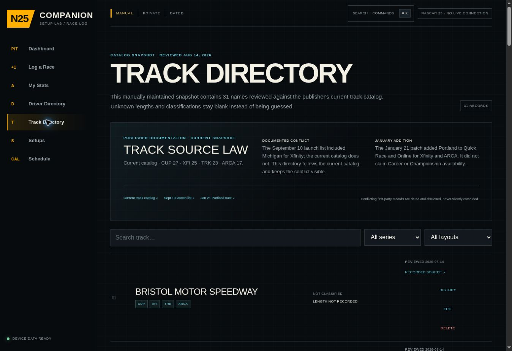

**What works**

- Search is fast and Phoenix filtering works.
- Track cards provide meaningful series context.
- History creates a useful bridge from reference content into personal data.

**Problems**

- Source-law copy again dominates before the records.
- Every seeded card exposes History, Edit, and Delete at the same visual level.
- The track detail selection is held only in client state; it has no stable track URL.
- Track-series relationships can become inconsistent through import or editing.

**Recommendation**

Use a stable route such as `/tracks/phoenix-raceway`, make History the primary action, and move reference editing behind an owner/admin affordance.

### 6. Phoenix Track History — **Good destination, weak persistence**

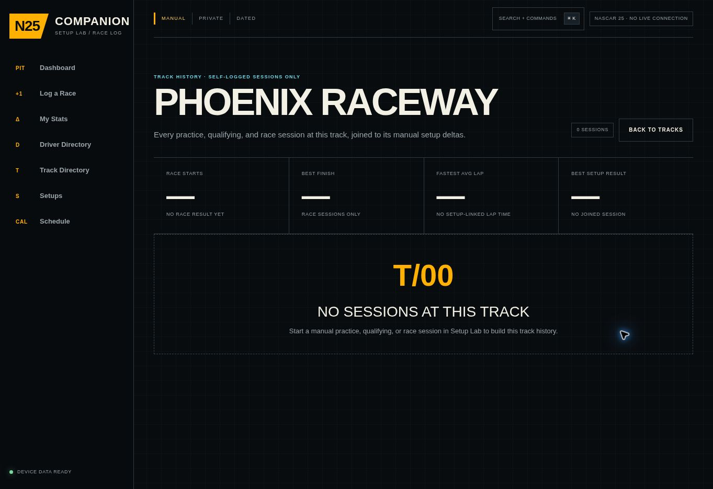

**What works**

- Clear empty state and appropriate track-specific metrics.
- Good conceptual home for setup insights and session history.
- The language encourages manual practice, qualifying, and race logging without pretending telemetry exists.

**Problems**

- Refreshing or sharing the page cannot reliably preserve the selected track.
- “Fastest average lap” and “best observed setup” inherit the attribution flaws described above.
- There is no run-level breakdown to distinguish warm-up, clean laps, traffic, tire age, fuel, or setup revision.

**Recommendation**

Give each track a durable URL and replace setup rankings with a run table showing setup revision, conditions, lap sample, best/median/variance, and notes.

### 7. Setups — **Highest-value area, buried by reference copy**

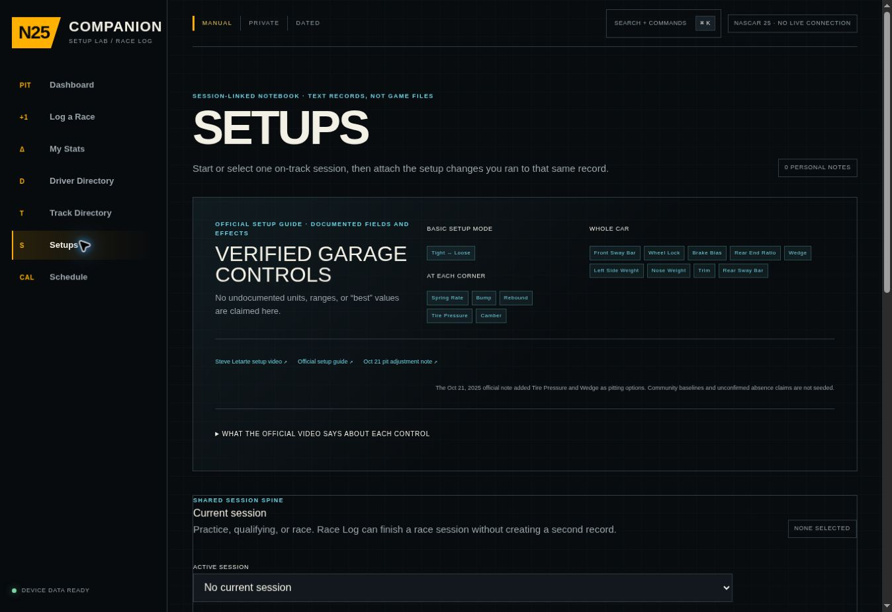

**What works**

- The no-community-setup boundary is honest.
- The design can support a focused lab experience.
- Current-session continuity is the right product direction.

**Problems**

- The first viewport is dominated by “Verified Garage Controls” and the official guide rather than the current setup task.
- The setup system is mostly freeform text. It lacks structured values, revision history, baselines, test hypotheses, run/stint data, and comparable conditions.
- There is no explicit car/build/platform/controller dimension.
- Jargon such as “Shared Session Spine” describes implementation rather than user intent.

**Recommendation**

Lead with one current-session workspace. Put the official guide in a collapsible Reference panel. Use plain-language labels: Current session, Baseline, Change, Test run, Result, Next change.

### 8. Setup Entry — **Clear form, incomplete lab model**

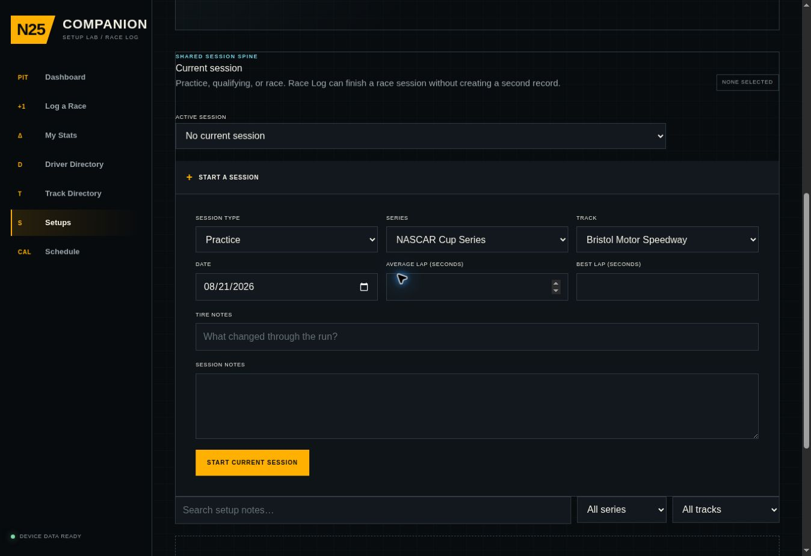

**What works**

- The form is visually clean and has a clear save action.
- A delta-based workflow is appropriate for iterative tuning.
- Linking notes to a current session is a sensible starting point.

**Problems**

- One shared pending/error/message state serves starting a session, updating a session, and saving a delta. Feedback can appear beside the wrong action.
- “Setup delta” is not enough to reproduce an installed setup without a structured baseline and revision chain.
- No run-level timing or outcome data is directly bound to the revision tested.
- No guard prevents multiple ambiguous deltas from being treated as the setup for one session.

**Recommendation**

Use separate action states and create immutable setup revisions. A test run should explicitly reference exactly one revision.

### 9. Schedule — **Lowest core utility and scope drift**

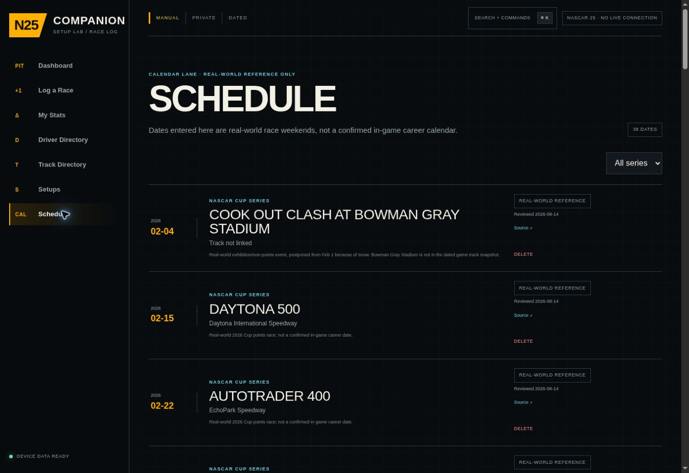

**What works**

- Dates and source status are clearly presented.
- Manual editing is transparent.

**Problems**

- The 38-item real-world Cup schedule is not the in-game career schedule and does not materially advance setup testing.
- Every record renders at once with a visible Delete control.
- The route competes with the core setup workflow for top-level navigation and maintenance effort.

**Recommendation**

Move Schedule under Reference/More or remove it until it can create a setup test plan. Do not imply that it mirrors in-game progression.

### 10. AI Review Map — **Development artifact; exclude from production IA**

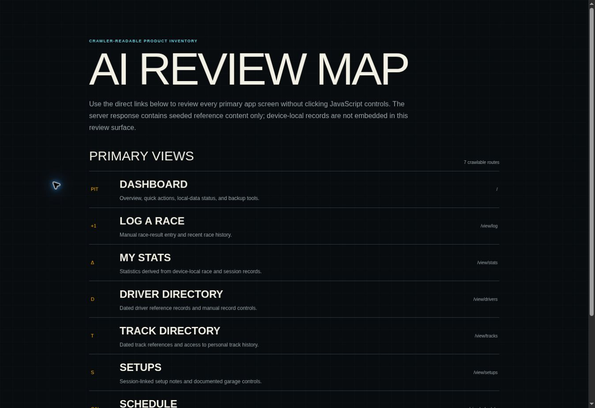

**What works**

- It gives crawlers a readable route inventory during review.

**Problems**

- It is an implementation/review artifact, not an owner task.
- It introduces SEO and crawlability work that conflicts with the private/local-first tone.
- The route, sitemap, robots file, and new view routes are unpublished working-copy changes and should not be confused with the current product.

**Recommendation**

Keep review maps in development tooling or gated preview environments, not production navigation or public indexing.

### 11. Command Palette — **Good shortcut concept, broken modal behavior**

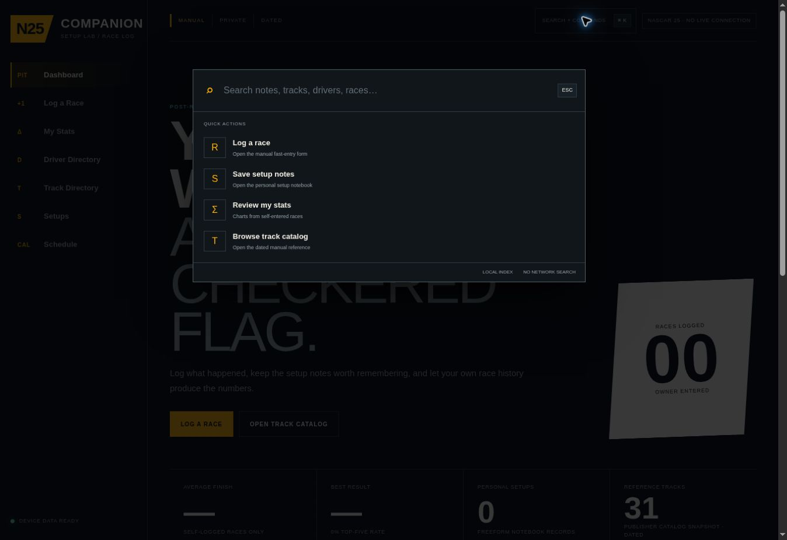

**What works**

- Visually compact and consistent with the app.
- Quick actions are valuable for a keyboard-heavy logging workflow.

**Problems**

- The dialog declares `aria-modal="true"` but does not trap focus.
- Keyboard focus moves through the palette, then to the document body and underlying sidebar links.
- Closing with Escape does not restore focus to the trigger.
- Quick actions use state navigation instead of the route model, preserving the URL mismatch.

**Recommendation**

Use a tested dialog primitive or implement focus capture, loop, inert background, Escape handling, and focus restoration. Route all navigation through one URL-aware mechanism.

## Priority findings

### P1 — Correct before expanding setup content

#### P1.1 Standalone races can mutate active sessions

The race form sends `sessionId: null` for a new race. The store interprets a missing ID as the global current session and rewrites that session with `sessionType: "race"`. A practice or qualifying session can therefore be silently converted and merged with an unrelated race.

**Impact:** lost session classification, corrupted history, misleading stats.  
**Required fix:** distinguish “create new” from “use current” explicitly; never fall back from a race creation request to global state.

#### P1.2 Race-to-setup attribution is not durable

The model has no durable applied-setup reference on the race result. Bootstrap and analytics infer a setup differently—first match in one path, latest update in another.

**Impact:** the same result can appear tied to different setups.  
**Required fix:** every test run and race result must reference one immutable setup revision.

#### P1.3 Lap performance is attributed at the wrong level

Lap samples are stored at session level, but setup conclusions are drawn from them. Multiple setup deltas in one session cannot be separated.

**Impact:** false “fastest setup” conclusions.  
**Required fix:** introduce a run/stint entity linking lap samples to one setup revision and one condition snapshot.

#### P1.4 Import validation does not enforce semantic safety

Root shape, IDs, timestamps, and some foreign keys are checked, but many field types, ranges, enum values, dates, finish positions, lap constraints, and text/URL semantics are not.

**Impact:** corrupt or hostile backups can poison the local store. Imported `javascript:` source URLs can become clickable in app origin and potentially access device-local data.  
**Required fix:** one shared strict schema validator, URI allowlist (`https:` with narrowly justified exceptions), size limits, and a preview/dry-run before replacement.

#### P1.5 Public hosting language conflicts with “PRIVATE” framing

The hosted site is configured with public access. Local records can still remain in IndexedDB, but the word “PRIVATE” can imply the app itself is access-controlled.

**Impact:** avoidable trust ambiguity.  
**Required fix:** either change hosting access or change copy to the precise claim: “Your records stay in this browser unless you export them.”

### P2 — Fix in the next product iteration

- **Multi-tab data loss:** each tab performs read-modify-write against the full root document with no transaction version or compare-and-swap.
- **URL/state split:** buttons and command palette change internal state without changing the URL; sidebar routes behave differently.
- **Offline deep links:** the service worker precaches the root but not direct `/view/*` navigation, so first-load deep links can fall back to the dashboard offline.
- **Modal accessibility:** command palette focus escapes and is not restored.
- **Mobile navigation risk:** seven 92 px bottom-nav items become a horizontally scrolling strip with 9 px labels at narrow widths.
- **Schema evolution:** a schema version exists, but there is no explicit migration registry for future data changes.
- **Series integrity:** sessions can reference a series that is not enabled for the linked track.
- **Action feedback:** setup actions share one feedback state and can display status in the wrong context.
- **Overloaded destructive controls:** seeded reference cards expose Delete too prominently.

### P3 — Quality and maintenance improvements

- Consolidate Drivers, Tracks, and Schedule under Reference/More.
- Replace implementation jargon with task language.
- Virtualize or paginate long directories.
- Add route-level loading and bundle budgets.
- Add PNG PWA icons and an Apple touch icon; SVG-only installation support is brittle.
- Define explicit security headers and a restrictive Content Security Policy.
- Scope service-worker cache cleanup to this app and add cache expiration/versioning.
- Centralize the production origin instead of duplicating it across files.
- Add a seed-data migration/freshness strategy rather than treating reference updates as ad hoc edits.

## Data and domain model assessment

### Current conceptual model

The current model treats sessions as a broad shared spine and attaches freeform setup deltas and results around it. This is compact, but it overloads one record with too many meanings.

### Required model

| Entity | Purpose | Key relationships |
|---|---|---|
| Setup program | One tuning goal, such as ARCA at Phoenix at night | Car/build, track configuration, game version, input platform |
| Baseline setup | Reproducible starting values | Belongs to one program |
| Setup revision | Immutable complete snapshot plus change rationale | Derived from a baseline or prior revision |
| Test session | Practice/qualifying/race context | Track, series, conditions, assists, controller |
| Test run / stint | One installed revision under one condition snapshot | Exactly one revision and one session |
| Lap sample | Best, median, spread, clean-lap count, notes | Belongs to one run |
| Race result | Start, finish, incidents, outcome notes | References one session and one applied revision |
| Insight | User conclusion and next hypothesis | Derived from one or more comparable runs |

The essential invariant is simple: **one run uses exactly one immutable setup revision**. That relationship should drive the log, stats, track history, and comparisons.

## Information architecture recommendation

Replace seven equal-weight top-level destinations with five task-oriented areas:

| Primary area | Owner question |
|---|---|
| Home | What am I testing next? |
| Session | What happened in this practice, qualifying, or race? |
| Setup | What exact revision am I running and changing? |
| Results | Did the change improve pace, consistency, or outcome? |
| More | Where are references, drivers, tracks, schedule, backup, and sources? |

The dashboard should feature a single current-program card with:

- Car/series and track
- Day/night and condition snapshot
- Current setup revision
- Last run metrics
- Current hypothesis
- “Start test run” as the primary action
- “Log race result” and “Change setup” as secondary actions

## ARCA at Phoenix (night) as the first complete program

The requested starting setup should become the vertical slice used to prove the product model—not merely a paragraph of suggested values.

The first complete program should include:

1. **Program identity:** ARCA car, Phoenix Raceway, night, game version/build, platform, controller/wheel, assists.
2. **Baseline:** every editable garage value captured as a complete immutable snapshot.
3. **Hypothesis:** one plain-language goal, such as entry stability, center rotation, drive-off, tire conservation, or long-run consistency.
4. **Revision:** exact changes from the baseline, with rationale.
5. **Run protocol:** fixed lap count, fuel/tire starting state, clean-lap rules, and whether traffic invalidates a sample.
6. **Metrics:** best clean lap, median clean lap, spread/consistency, subjective balance by corner phase, and tire notes.
7. **Decision:** keep, revert, or branch the revision.
8. **Race result:** explicitly linked to the revision actually used.

This vertical slice will expose missing garage fields, bad terminology, and comparison gaps before the app expands to other cars and tracks.

## Accessibility review

### Strengths

- Most screens use a single clear heading and appropriate section labels.
- Many icon-like marks are hidden from assistive technology.
- Status messages commonly use `role="status"`.
- Charts include accessible labels.

### Risks

- Command palette violates modal focus expectations.
- Focus restoration is missing.
- Native browser errors are not summarized at form level.
- Nine-pixel mobile navigation labels are too small for dependable use.
- Dense all-caps/technical labels and long provenance copy increase cognitive load.
- Repeated destructive actions create keyboard and screen-reader noise.
- Mobile touch-target sizing and horizontal overflow were not verified in a live narrow viewport.

### Required acceptance checks

- Complete every core flow with keyboard only.
- Visible focus on every interactive element.
- No focus escape from modal dialogs.
- Focus returns to the invoker after close.
- Minimum 44 × 44 px touch targets on mobile.
- Text remains readable at 200% zoom without two-dimensional scrolling.
- Form errors are associated with fields and summarized near the form heading.

## Performance review

Observed build measurements from the current checkout:

- Shared application chunk: approximately 111,880 bytes
- `/view/drivers` rendered HTML: approximately 217,332 bytes
- `/view/tracks` rendered HTML: approximately 154,511 bytes

The app is still small enough to feel responsive on desktop, but the architecture front-loads reference records and shares one large client shell across routes. Long directories should be paginated or virtualized, and reference data should not block the core setup workflow.

Recommended budgets:

- Core route initial JavaScript: under 150 KB compressed
- Route HTML: under 75 KB for normal screens
- No top-level directory rendering more than 50 cards without pagination/virtualization
- No service-worker cache entry without a version and expiration policy

## Offline, storage, and backup review

### Strong foundations

- IndexedDB is appropriate for device-local structured data.
- Export/import is essential and visibly available.
- The app does not pretend to have game telemetry or cloud sync.
- Empty states are honest and do not fabricate statistics.

### Weaknesses

- Whole-document overwrites create multi-tab loss risk.
- Import replacement is all-or-nothing without semantic preview.
- Offline first-load deep links are not reliably cached.
- Service-worker caching is broad and indefinite for same-origin GET requests.
- Cache cleanup can remove unrelated same-origin caches.
- Device-local data has no automatic backup or conflict model.

Recommended storage approach: use normalized IndexedDB object stores or an append-only event log with transactional indexes, optimistic version checks, a BroadcastChannel for tab coordination, and explicit migrations.

## Security and privacy review

### Highest-risk issue

Imported source links accept unsupported URI schemes. A crafted backup can add a `javascript:` link that executes if clicked. URI validation must occur during import and again at render time.

### Additional hardening

- Validate file type, byte size, schema version, all ranges, enums, and text lengths before import.
- Render external links only through a safe URL helper.
- Add Content Security Policy, `Referrer-Policy`, `Permissions-Policy`, and clickjacking protection.
- Treat backups as untrusted input even when the user selected the file.
- State the privacy model precisely: public app shell, browser-local records, manual export, no account/sync.

## Engineering quality

The current checkout passed:

- `npm run lint`
- `npm test`
- Production build
- 51 automated tests
- `git diff --check`

This is a meaningful strength. The existing tests cover content boundaries, local-first behavior, portable data, rendering, search, stats, store behavior, and UI contracts.

The gaps are predominantly semantic and interaction-level. Add regression tests for:

1. “New race” never reuses a non-race current session.
2. Every result and run has exactly one applied setup revision.
3. Stats never infer setup attribution.
4. Import rejects unsafe URL schemes and invalid numeric/domain ranges.
5. Concurrent tabs detect and resolve version conflicts.
6. Direct routes load offline after installation.
7. Command palette traps and restores focus.
8. Dashboard, sidebar, and command palette all produce the same route URL.

## Recommended delivery sequence

### Phase 0 — Integrity and trust gate

- Fix standalone-race session mutation.
- Add explicit applied-setup relationships.
- Stop publishing setup-performance rankings until run-level attribution exists.
- Harden import validation and URL safety.
- Clarify public-shell versus local-record privacy language.

**Exit condition:** no user action can silently reclassify a session or ambiguously attribute a result.

### Phase 1 — Core domain rebuild

- Introduce setup programs, immutable revisions, sessions, runs/stints, lap samples, and explicit results.
- Add schema migration registry and transactional writes.
- Implement multi-tab coordination.

**Exit condition:** one ARCA/Phoenix/night program can be reproduced from baseline through result.

### Phase 2 — Setup workspace

- Rebuild the Setup screen around the current program.
- Add structured garage controls, revision comparison, hypothesis, run protocol, and keep/revert decisions.
- Make ARCA at Phoenix (night) the reference vertical slice.

**Exit condition:** a user can create, test, compare, and reproduce two revisions without freeform inference.

### Phase 3 — IA, mobile, and accessibility

- Collapse references under More.
- Unify state and route navigation.
- Add stable track/program URLs.
- Replace the command palette with an accessible dialog.
- Redesign mobile navigation for five primary items.

**Exit condition:** all core flows pass keyboard, zoom, and narrow-screen checks.

### Phase 4 — PWA, performance, and operational polish

- Cache direct routes correctly.
- Add cache versioning and expiration.
- Paginate/virtualize directories.
- Add install icons and security headers.
- Establish performance budgets and seed-data migrations.

**Exit condition:** installed and first-load-offline behavior is predictable, and no reference route bloats the core workflow.

## Go/no-go recommendation

**No-go for broad setup rollout in the current model.** Do not add a library of car/track setup values yet; it would compound ambiguous attribution and freeform data debt.

**Go for a focused recovery release.** Fix Phase 0, then implement ARCA at Phoenix (night) as the single end-to-end proof of the corrected lab model. The visual design can remain largely intact; the necessary work is product hierarchy, domain semantics, interaction consistency, and safety.

## Working-copy note

The audit preview contains local unpublished changes: modified global styles/layout/page/navigation/tests plus new view routes, a review route, robots/sitemap routes, navigation/bootstrap helpers, and crawlability tests. Hosted Sites version 7 may not include those changes. No source files were changed during this audit.
